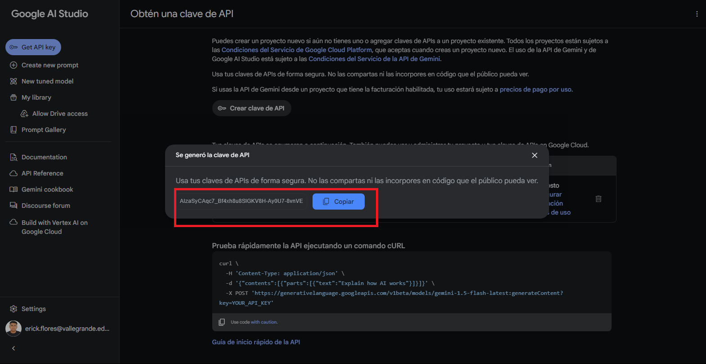
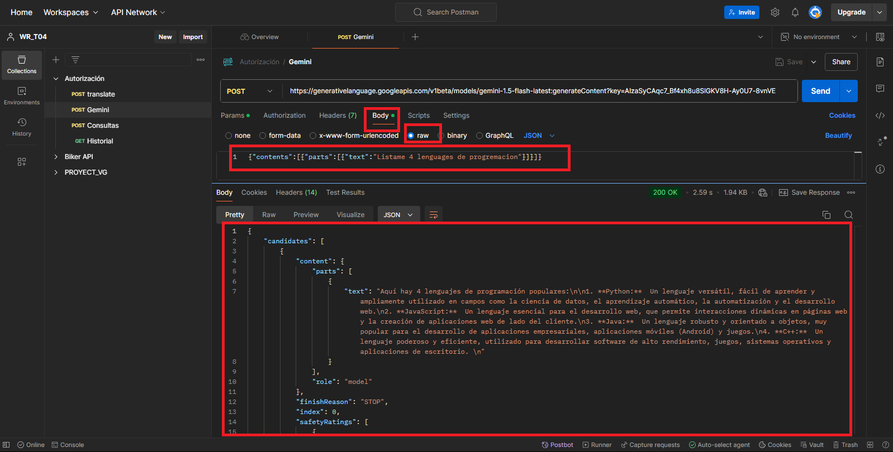
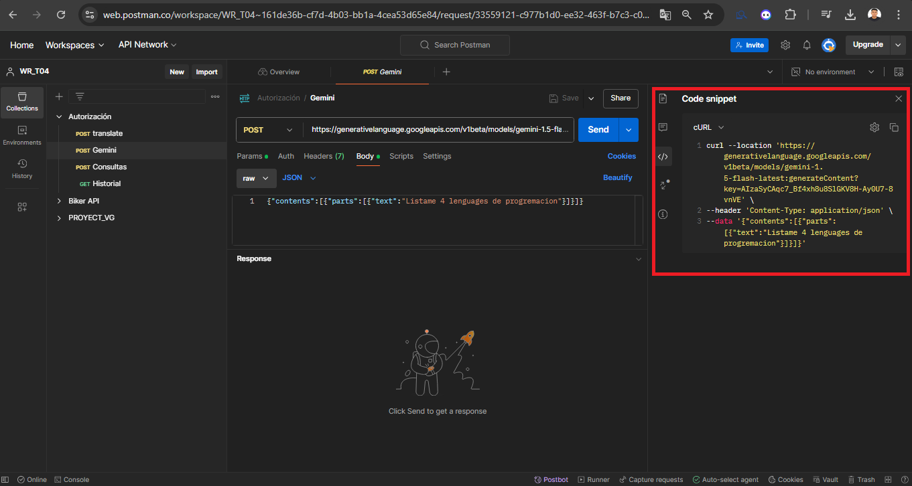
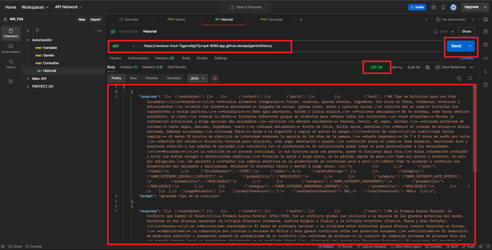
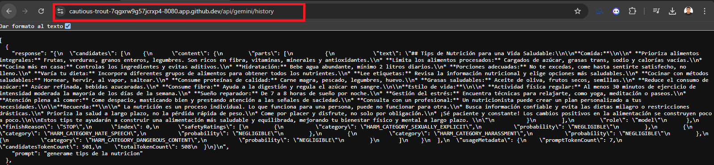

# SpringBoot

- Paso 1 ingresamos a la plataforma Google AI Studio y ingresamos a la opcion Get API Key. Pulsamos la opcion de crear clave de api.

- Paso 2 elegimos la primera opcion para que genere nuestra clave de api personal

- Paso 3 pulsamos sobre la opcion que indeca la imagen 

- Paso 4 luego nesecitamos copiar clave que nos genera. Es muy importante esta clave para funcione correctamente la api que usaremos de gemini

- Paso 5 Ingresamos a postman creamos un metodo post y pegamos el link de gemini. Luego ingresamos a la opcion Params pegamos nuestra clave Key

- Paso 6 Luego ingresamos a la opcion body y escogemos el formato raw. Luego escribimos una consulta a la api haci como muestra la imagen del ejemplo

- Paso 7 Luego en la opcion  </> copiamos el codigo que nos genera postman

- Paso 8 Luego lo implemetamos en nuestro spring boot, con un service y controller. Luego lo ejecutamos y hacemos las prubas necesarias en el postman

- Paso 9 creamos un metodo post y hacemos uso de nuestra url que destinamos usar para hacer consultas a la inteligencia artificial. Luego hacemos una consulta como se muestra en la imagen.

 
- Paso 10 creamos un metodo get y hacemos uso de nuestra url que destinamos para que muestre nuestro historial de consultas.

- Paso 11 tambien podemos usar en nuestro navegador de preferencia y usamos la url get. Para ver que funcione corretamente nuetro spring boot consumiendo api de un servicio cognitivo

