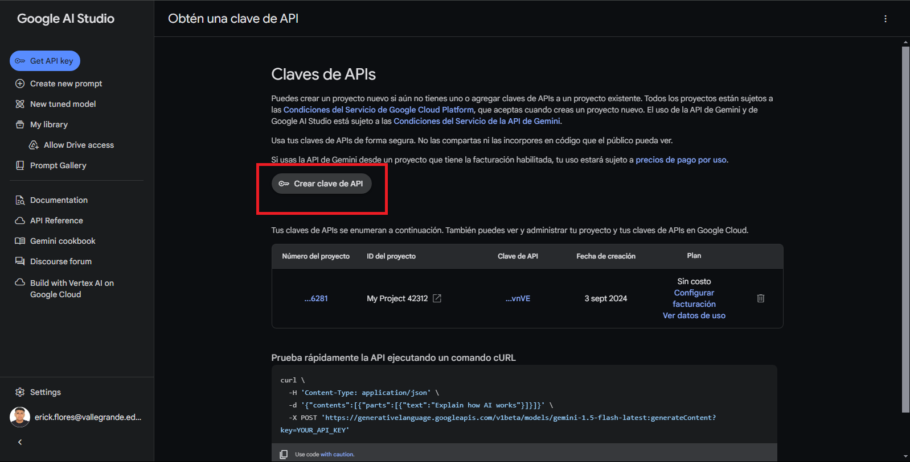
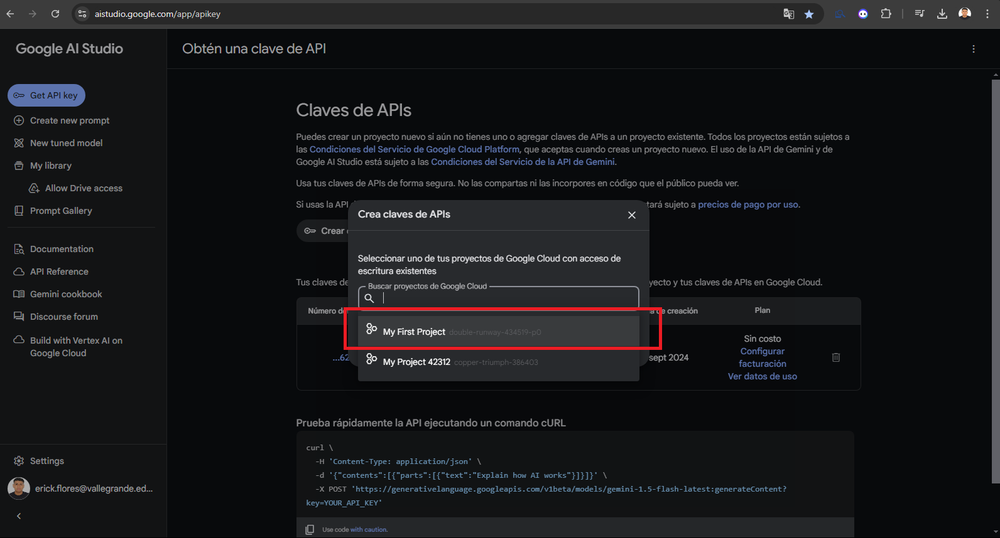
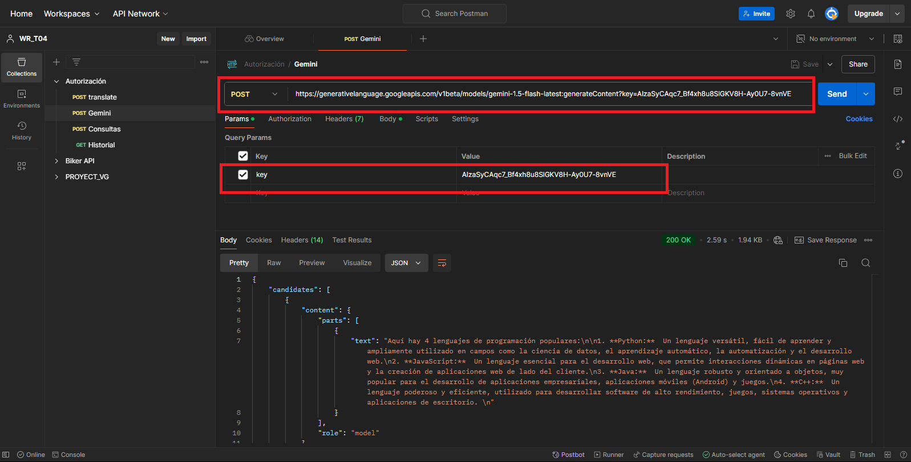

# SpringBoot

- Paso 1 ingresamos a la plataforma Google AI Studio y ingresamos a la opcion Get API Key. Pulsamos la opcion de crear clave de api.

- Paso 2 elegimos la primera opcion para que genere nuestra clave de api personal

- Paso 3 pulsamos sobre la opcion que indeca la imagen 

- Paso 4 luego nesecitamos copiar clave que nos genera. Es muy importante esta clave para funcione correctamente la api que usaremos de gemini

- Paso 5  

- Paso 6

